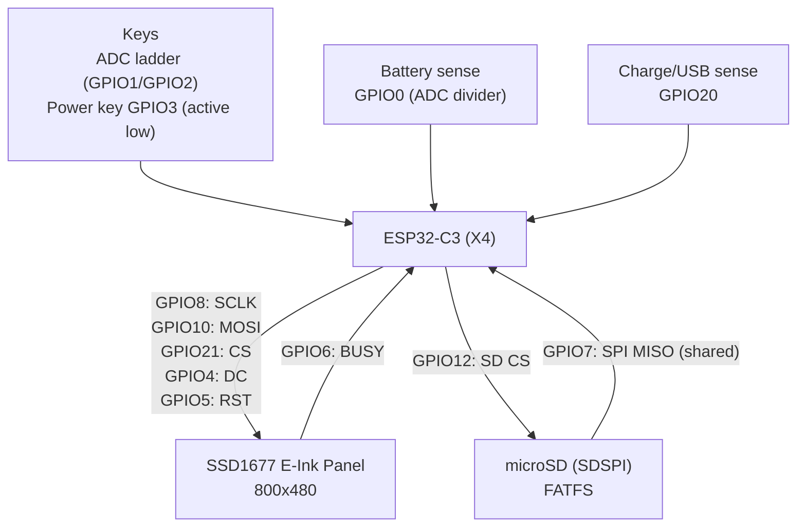

# XTEINK X4 Integration into TuyaOpen

This document describes the XTEINK X4 board integration as a production-style TuyaOpen board support package (BSP), rather than a one-off demo implementation.

XTEINK X4 is an affordable e-ink hardware platform for custom firmware development. Combined with TuyaOpen, it provides practical access to connectivity capabilities, Wi-Fi/Bluetooth stack support, and an AI-ready software stack for advanced embedded workflows.

---

## Integration Objectives

The integration targets the following objectives:

- Keep all board-specific details in one place (`boards/ESP32/XTEINK_X4`)
- Expose stable APIs to application code (`board_com_api.h`)
- Match product-grade power/wake behavior (short/long press, deep sleep gate)
- Support both quick demo validation (`lvgl_demo`) and full firmware applications

The outcome is a reusable BSP layer that can be consumed by multiple applications without reworking low-level pin and driver logic.

---

## Hardware Block Diagram

The following block diagram summarizes the hardware integration model:



---

## Board Directory Layout

Inside the board directory:

- `board_config.h`  
  Pin mapping + panel dimensions + viewable/active-area constants
- `board_com_api.h`  
  Public BSP API for app layer
- `xteink_x4.c`  
  High-level board services (sleep, wake classification, panel area helpers)
- `xteink_x4_epd.c`  
  SSD1677 EPD driver path
- `xteink_x4_buttons.c`  
  ADC ladder + power key bitmask reading
- `xteink_x4_battery.c`  
  Battery voltage + percentage estimation
- `xteink_x4_sdcard.c`  
  FATFS-based SD helpers

For visual validation:

- `example/lvgl_demo/src/example_xteink_x4_lvgl.c`

---

## Main BSP APIs

These APIs are the primary integration surface for application code:

### Board bring-up

- `board_register_hardware()`

### Display path

- `board_x4_epd_init()`
- `board_x4_epd_display()`
- `board_x4_epd_display_full_refresh()`
- `board_x4_epd_sleep()`

### Inputs / battery / SD

- `board_x4_buttons_get_state()`
- `board_x4_battery_read()`
- `board_x4_sdcard_mount()`
- `board_x4_sdcard_get_usage()`

### Sleep / wake behavior

- `board_x4_sleep_classify_wakeup()`
- `board_x4_power_verify_gpio_wake(required_duration_ms, short_press_allowed)`
- `board_x4_power_shutdown()`

### Active/viewable area helper

- `board_x4_panel_viewable_get(&x, &y, &w, &h)`

This helper is used to keep UI content inside the panel's safe visible region.

---

## Sleep and Wake Policy

Flow:
1. Classify wake cause (`power button`, `after usb power`, etc.)
2. If wake is from power button, verify long-press duration
3. If released too early, re-enter deep sleep
4. For runtime shutdown, require long power hold, then push final UI and sleep

This policy prevents accidental wake/run transitions and improves real-device behavior consistency.

---

## Active Area Handling

The physical panel is 800x480, but content is not rendered edge-to-edge.
Panel viewable constants from `board_config.h` define the effective UI canvas.

In LVGL-style screens, this maps cleanly to screen padding:

- left/right/top/bottom inset = board-defined viewable margins
- all dashboard boxes, title bars, and footers derive from `render_w` / `render_h`

This decision addresses most clipping and half-cut text issues.

---

## Getting Started: Custom Firmware

The following is a direct startup path:

### 1) Pick X4 board config

From repo root:

```bash
cp config/XTEINK_X4.config app_default.config
```

`config/XTEINK_X4.config` is the main board preset for XTEINK X4.

### 2) Initialize TuyaOpen environment

```bash
cd TuyaOpen
. ./export.sh
```

### 3) Build the recommended first demo (`lvgl_demo`)

The first project developers should build is:

- `TuyaOpen/boards/ESP32/XTEINK_X4/example/lvgl_demo`

After sourcing the environment, change into that folder and build:

```bash
cd boards/ESP32/XTEINK_X4/example/lvgl_demo
tos.py build
```

### 4) Start from the X4 BSP APIs

In application initialization:

- Call `board_register_hardware()`
- Classify wake via `board_x4_sleep_classify_wakeup()`
- Gate boot via `board_x4_power_verify_gpio_wake(...)` when needed
- Initialize UI and EPD refresh policy

### 5) Add application loop logic

Typical loop structure:

- Read keys: `board_x4_buttons_get_state()`
- Refresh data: battery/SD status
- Draw to framebuffer / LVGL
- Select fast or full display update based on scene

---

## Minimal Custom App Skeleton

```c
OPERATE_RET app_init(void)
{
    OPERATE_RET rt = OPRT_OK;
    X4_WAKEUP_CLASS_E cls;

    TUYA_CALL_ERR_RETURN(board_register_hardware());
    TUYA_CALL_ERR_RETURN(board_x4_sleep_classify_wakeup(&cls));

    if (cls == X4_WAKEUP_CLASS_POWER_BUTTON) {
        TUYA_CALL_ERR_RETURN(board_x4_power_verify_gpio_wake(3000U, FALSE));
    }

    TUYA_CALL_ERR_RETURN(board_x4_epd_init());
    return OPRT_OK;
}
```

---

## Practical Notes

- Use full refresh for mode transitions and splash screens; use faster updates for interactive pages.
- Keep power logic centralized in BSP API calls, not scattered through UI code.
- Always design the dashboard from the viewable area first, then divide into cards.
- For X4 keys, a two-column card layout is safer than a long vertical list in constrained quadrants.

---

## Next Steps

For product firmware expansion, suggested next steps:

- Add a service layer (IM, automation, sensor workflows)
- Persist settings/profile to SD or KV
- Build a system menu for refresh mode, sleep timeout, and diagnostics
- Add OTA and factory-reset handling

A practical development pattern is to introduce one new API in `board_com_api.h` and consume it in a small demo screen first, then promote it into the main firmware path.

---

## Disclaimer

This write-up is an independent integration document and has no affiliation with XTEINK.

Custom firmware flashing and hardware/software modifications are entirely at the operator's own risk. They may void warranty coverage. No responsibility or liability is accepted for damage, data loss, device malfunction, or other outcomes caused by firmware changes.

